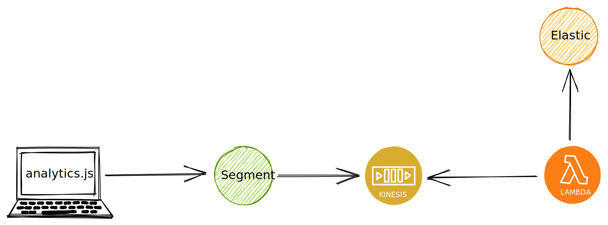

# Conversion analytics

We collect sparse, intentional data from across the site to help us follow a [data-informed process](https://stacks.wellcomecollection.org/data-informed-not-data-driven-13377c77d198)
to improve the performance of our services.

## Architecture

Data is collected from wellcomecollection.org via [Segment Analytics.js](https://segment.com/docs/connections/sources/catalog/libraries/website/javascript/) [source](https://segment.com/docs/connections/sources/#what-is-a-source).

This data is pushed onto a [Kinesis stream as a destination](https://segment.com/docs/connections/destinations/catalog/amazon-kinesis/).

A AWS lambda then pushes this data into our [reporting cluster](https://reporting.wellcomecollection.org) for analysis.

## Git history?

[This project used to live here](https://github.com/wellcomecollection/search-logger) but has been moved into this repo for greater visibility and maintainability.