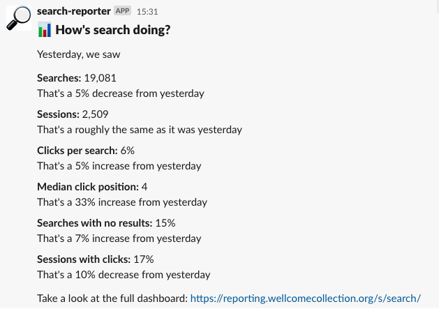

# Search reporter

Runs a lambda every weekday, gathering overview statistics about search performance and posting a summary message to the `#wc-search` slack channel:



## Test lambda with docker

```
docker run --rm -v ~/.aws/:/root/.aws:ro $(docker build -q .)
```

## Zip the lambda and upload to s3

```
zip -r lambda.zip lambda/

aws s3 cp lambda.zip s3://wellcomecollection-platform-infra/lambdas/reporting/search_reporter.zip
```
